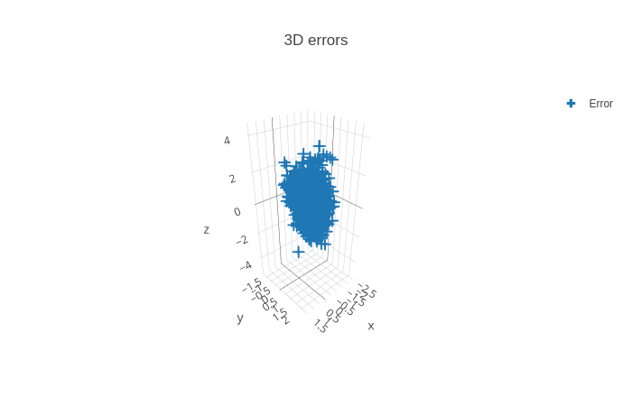
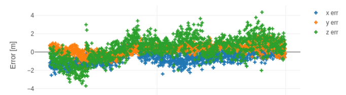

RINEX-Cli
=========

[](https://github.com/rtk-rs/rinex-cli/actions/workflows/rust.yml)
[](https://github.com/rtk-rs/rinex-cli/actions/workflows/daily.yml)
[](https://crates.io/crates/rinex-cli)

[](https://github.com/rtk-rs/rinex-cli/blob/main/LICENSE)

`rinex-cli` is a command line tool to post process RINEX + SP3 data.  

Since RINEX and SP3 cover many applications, so does `rinex-cli`. You can use
this toolbox for

- Analysis and high level report synthesis
- Data patching and fixing
- Data synthesis (RINEX, CSV)
- Post processed navigation and PVT solutions solving
- High precision PVT solutions solving 
- Timing solutions solving




## Download the tool

You can download the latest version from [the release portal](https://github.com/rtk-rs/rinex-cli/releases)

## Install from Cargo

You can directly install the tool from Cargo with internet access:

```bash
cargo install rinex-cli
```

## Build from sources

Download the version you are interested in:

```bash
git clone https://github.com/rtk-rs/rinex-cli
```

If you're interested in running one of the demos, you will need the data submodule:

```bash
git clone --recurse-submodules https://github.com/rtk-rs/rinex-cli
```

This will build and install the stripped binary to `${HOME}/.cargo/bin`, which
is usally defined in the ${PATH}. Because our examples span all applications, you should
activate `--all-features`:

```bash
cargo install --all-features --path .

rinex-cli --version

which rinex-cli
${HOME}/.cargo/bin/rinex-cli
```

## File formats & revisions

`rinex-cli` supports 

- all formats & revisions supported by [the RINEX parser](https://github.com/rtk-rs/rinex)
- all revisions supported by [the SP3 parser](https://github.com/rtk-rs/sp3)

Summary:

| Format                 | File name restrictions            |    Support                         |
|------------------------|-----------------------------------|------------------------------------|
| RINEX                  | :heavy_minus_sign:                | :heavy_check_mark:                 |
| CRINEX                 | :heavy_minus_sign:                | :heavy_check_mark:                 | 
| gzip compressed RINEX  | Name must end with `.gz`          | :heavy_check_mark:                 | 
| gzip compressed CRINEX | Name must end with `.gz`          | :heavy_check_mark:                 | 
| .Z compressed RINEX    | Not supported                     | Not supported                      |
| DORIS RINEX            | :heavy_minus_sign:                | :construction: Work in progress    |
| gzip compressed DORIS  | Name must end with `.gz`          | 
| .Z compressed DORIS    | Not supported                     | Not supported                      |
| SP3                    | :heavy_minus_sign:                | :heavy_check_mark:                 | 
| gzip compressed SP3    | Name must end with `.gz`          | :heavy_check_mark:                 | 
| .Z compressed SP3      | Not supported                     | Not supported                      |
| BINEX                  | :heavy_minus_sign:                | :heavy_minus_sign:                 |
| UBX                    | :heavy_minus_sign:                | :heavy_minus_sign:                 |

:heavy_minus_sign: No restrictions: file names do not have to follow naming conventions.  

## Documentation

:warning: All our examples and demos are expected to be execute at the base of this repo.

Once you have installed the tool, read the first few steps:

- [File loading interface](./documentation/FileLoading.md): learn how to load data into the toolbox
- [The Preprocessor documentation](./documentation/Preprocessor.md) will teach you
how design a filter and deploy up to complex processing pipelines
- [The Input / Output page](./documentation/InputOutput.md) summarizes the output you can
generate, based on your input products

Then, continue your learning journey with:

- [`merge` mode](./documentation/Merge.md): to merge RINEX files together,
which is particularly useful in Data production context & files management

- [`split` mode](./documentation/Split.md): divide/split your input products at a specific point in time (`Epoch`)
- [`cbin` (constellation/nav binning) mode](./documentation/Cbin.md) create a batch (file series) of RINEX on Constellation and Timescale basis
- [`tbin` (time binning) mode](./documentation/Tbin.md) create a batch (file series) of RINEX of equal duration

- [`diff` mode](./documentation/Diff.md): create a special RINEX=RINEX(A)-RINEX(B)
by substracting two observation RINEX files together, per frequency and signal modulations

- [`filegen` mode](./documentation/Filegen.md): generate output products (RINEX, SP3, CSV..)
after a possible preprocessing pipeline. Use this to either reformat RINEX or perform a RINEX to CSV conversion.

## Post Processed Positioning

Dive into the world of precise navigation:

- [`ppp` opmode introduction](./documentation/PPP.md)
- [`ppp` with special `--cggtts` option](./documentation/CGGTTS.md)

Examples
========

[Many examples](./examples/README.md) are provided for each mode individually.

Demos
=====

Our [Demo folder](./demos) hosts many illustrations and high level applications

Special Thanks
==============

These tools would not exist without the great libraries written by C. Rabotin, 
[check out his work](https://github.com/nyx-space).  

Some features would not exist without the invaluable help of J. Lesouple, through
our countless discussions. Check out his 
[PhD manuscript (french)](http://perso.recherche.enac.fr/~julien.lesouple/fr/publication/thesis/THESIS.pdf?fbclid=IwAR3WlHm0eP7ygRzywbL07Ig-JawvsdCEdvz1umJJaRRXVO265J9cp931YyI)

## Licensing

This application is part of the [RTK-rs framework](https://github.com/rtk-rs) which
is delivered under the [Mozilla V2 Public](https://www.mozilla.org/en-US/MPL/2.0) license.
